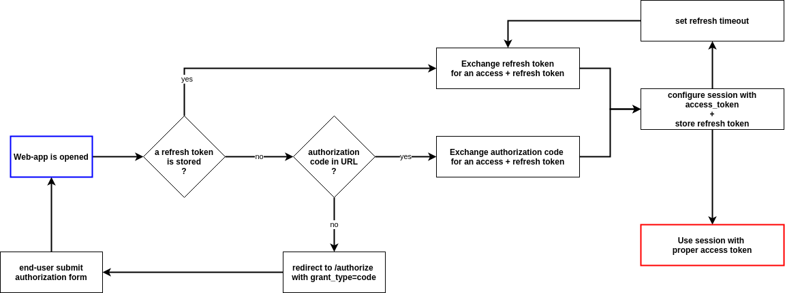

# OctoAuth javascript client

Client library for OctoAuth identity server...

## Installation

```
npm install --save octoauth-client
```

## Usage

Instanciate OctoAuth client.

```javascript
import {OctoAuthClient} from 'octoauth-client'

const octo = new OctoAuthClient({
    clientId: 'social-network', 
    redirectURI: 'http://social.example.com', 
    scopes: ['friends:read', 'friends:edit'], 
    serverURL: 'https://accounts.example.com'
})
```

Get token using authorization code flow.
```javascript
const authorizationCode = octo.getAuthorizationCode();
let accessToken = octo.getAccessToken(authorizationCode);
```

## How it works ?


*Illustration: implementation of pkce flow for public client*

## Sources

- [proof key for code exchange by oauth public clients (rfc7636)](https://datatracker.ietf.org/doc/html/rfc7636)
- [generate cryptographically secure random numbers](https://developer.mozilla.org/en-US/docs/Web/API/crypto_property)

## Roadmap

- Support both implicit flow, and authorization code with PKCE.
